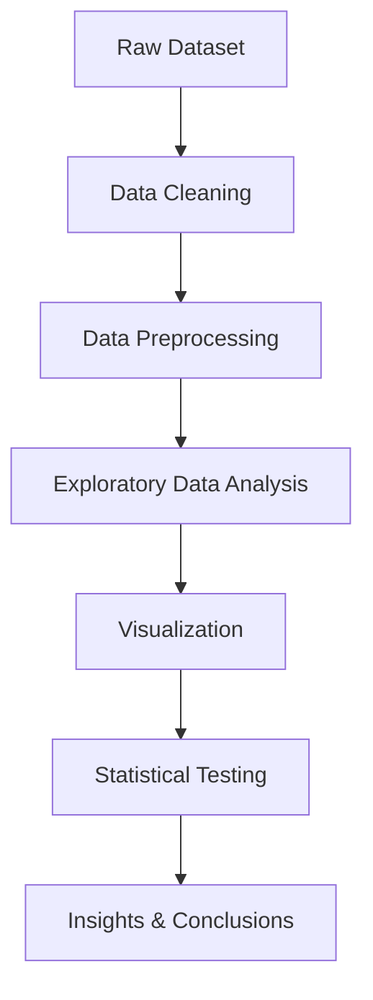

# 📊 Customer Service Request Analysis

<div align="center">


<br>


</div>

---

# 🚀 Project Overview

This project focuses on analyzing **Customer Service Requests** data to uncover valuable insights, trends, and service performance patterns.  
The dataset contains multiple complaint categories across different cities, along with response and resolution times.

The project applies:

✔️ Data Cleaning & Preprocessing  
✔️ Exploratory Data Analysis (EDA)  
✔️ Statistical Testing  
✔️ Visualization Techniques  
✔️ Insight Generation  

The primary goal is to evaluate **service efficiency**, identify high-frequency complaint types, and analyze response behavior across cities.

---

# 📌 Objectives

- Analyze customer complaints data
- Identify the most common complaint categories
- Study city-wise complaint distribution
- Evaluate response & resolution times
- Perform statistical testing on service performance
- Generate actionable insights from data

---

# 🛠️ Tools & Technologies

| Technology | Purpose |
|------------|---------|
| Python | Data Analysis |
| Pandas | Data Manipulation |
| NumPy | Numerical Computing |
| Matplotlib | Data Visualization |
| Seaborn | Statistical Visualization |
| SciPy | Statistical Testing |

---

# 📂 Project Workflow



---

# 🔍 Key Features

✨ Data Cleaning & Preprocessing  
✨ Exploratory Data Analysis (EDA)  
✨ Complaint Type Analysis  
✨ City-wise Complaint Distribution  
✨ Response Time Analysis  
✨ Statistical Testing  
✨ Insight Generation  

---

# 📊 Exploratory Data Analysis

The EDA process includes:

- Missing value handling
- Duplicate data removal
- Complaint category analysis
- Trend identification
- City-based comparisons
- Response time distribution analysis

---

# 📈 Statistical Analysis

This project uses statistical methods to identify significant differences in service response times.

### Tests Applied:

- **ANOVA Test**
- **Kruskal-Wallis Test**
- **P-value Analysis**

These tests help determine whether complaint categories significantly affect response efficiency.

---

# 📌 Key Insights

✔️ Identified the most frequent complaint categories  
✔️ Analyzed city-wise service request distribution  
✔️ Evaluated average response times  
✔️ Detected variations in service efficiency  
✔️ Generated data-driven business insights  

---

# 🧠 Outcome

The analysis provides a deeper understanding of customer complaint behavior and operational efficiency.  
It helps organizations improve:

- Service response management
- Resource allocation
- Complaint resolution strategies
- Customer satisfaction

---

# 📷 Sample Visualizations

<div align="center">


</div>

---

# 📁 Project Structure

```bash
Customer-Service-Request-Analysis/
│
├── data/
│   ├── raw_data.csv
│   └── cleaned_data.csv
│
├── notebooks/
│   └── analysis.ipynb
│
├── visuals/
│   └── charts/
│
├── README.md
└── requirements.txt
```

---

# ▶️ Installation

```bash
# Clone the repository
git clone https://github.com/yourusername/customer-service-request-analysis.git

# Navigate into the folder
cd customer-service-request-analysis

# Install dependencies
pip install -r requirements.txt
```

---

# ▶️ Run The Project

```bash
jupyter notebook
```

Open the notebook and run all cells to reproduce the analysis.

---

# 🌟 Future Improvements

- Build interactive dashboards using Tableau/Power BI
- Add machine learning models for prediction
- Automate report generation
- Deploy dashboard on cloud

---

# 🤝 Connect With Me

<div align="center">

<a href="https://github.com/yourusername">

</a>

<a href="https://www.linkedin.com/">

</a>

<a href="mailto:yourmail@gmail.com">

</a>

</div>

---

<div align="center">

## 💻 Keep Learning • Keep Building • Keep Growing 🚀


</div>
